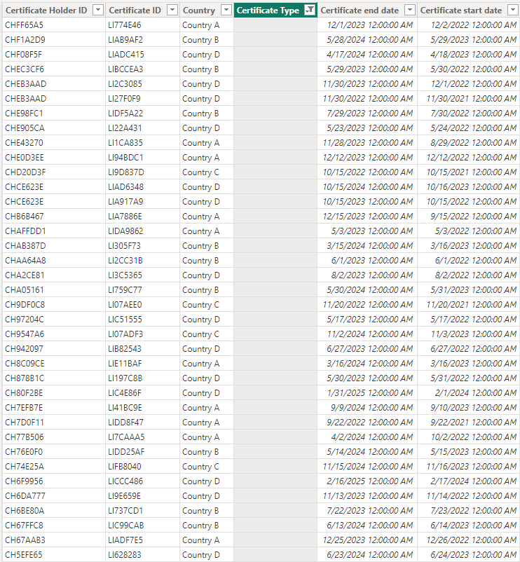

# Rainforest Alliance Home Task Assignment

As no specific tool was designated for this task, I opted to utilize the **PowerBI** for data analysis and visualization, and **Python** for data cleaning. Also, I did some analysis and data visualizations using **Jupyter Notebooks**, not as primary analysis approach but for show off my abilities 😎. You can find the work steps and the project file in this link. If you have any questions, feel free to reach out to me 😉

## 0. Repository Structure
- [Input Data Folder](rainforest_alliance/input_data): Included RAW given CSV Files, before cleaning
   - [Certificate Holders Data](rainforest_alliance/input_data/certificate_holders_input.csv)
   - [Volume and Crops Data](rainforest_alliance/input_data/volume_and_crops_input.csv)
- [Output Data Folder](rainforest_alliance/output_data): Included CSV files made by **[app.py](rainforest_alliance/app.py)** for data cleaning
   - [Certificate Holders Records validated and ready for analysis](rainforest_alliance/output_data/certificate_holders_validated.csv)
   - [Certificate Holders Records having issue from validation, need to be checked](rainforest_alliance/output_data/certificate_holders_need_check.csv)
   - [Volume and Crops Records validated and ready for analysis](rainforest_alliance/output_data/volume_and_crops_validated.csv)
   - [Volume and Crops Records having issue from validation, need to be checked](rainforest_alliance/output_data/volume_and_crops_need_check.csv)
- [Data Cleaning App](rainforest_alliance/app.py): **Data Cleaning Application** including validation rules
- [PowerBI-Based Analysis and Visualizations](rainforest_alliance/PowerBIDashboard.pbix): **Data Analysis & Visualizations** are here, using PowerBI.
- [Jupyter-Based Analysis and Visualizations](rainforest_alliance/analysis.ipynb): ShowOff my Python Data Analysis abilities, using Pandas, NumPy, Seaborn, ScikitLearn, etc
- [Application Log](rainforest_alliance/app.log): Including issues found during data cleaning


 
## 1. Data Import

Import both CSV files into Power BI Desktop.


## 2. Data Validation and Cleaning 

I focused on identifying and addressing any issues or inconsistencies in the data that could affect the accuracy of your analysis, such as:


### 2.1. Missing Values

I used Power Query Editor to identify and handle missing values. During the initial data review, I observed that 59 rows of data in the "Certificate Holders" table are missing the "Certificate Type". 





**Practical Approaches**: I have chosen to remove them at this stage.


### 2.2. Duplicate Rows

To identify duplicate rows in each table, I created a new tab named "Data Cleaning" in Power BI. I calculated the total number of rows and the unique number of each ID (Certificate Holder ID and Certificate ID). I observed that there are 4 duplicate values in the "Volume and crops" table. To find the values that were repeated, I used the Group By transformation in Power Query Editor grouped the data by the primary key column, and counted the number of occurrences of each value. I found four "Certificate IDs" that were repeated two times.


**Practical Approaches**: To address this issue, I need to first consult with the stakeholders and inquire whether two types of crops can belong to the same Certificate ID. Since I don't have the answer to this question, I've decided not to make any changes in this section for now.


### 2.3. Inconsistent Data Types

I ensured that each column in the dataset had the correct data type assigned to it. For example, numeric columns should be formatted as numbers, date columns should be formatted as dates, and text columns should be formatted as text.

**Practical Approaches:** No Action Required. All data types were correct.


### 2.4. Data Formatting


#### 2.4.1. Certificate ID and Certificate Holder ID

At first glance, I observed that the majority of values in the “Certificate ID” and “Certificate Holder ID” columns consist of a combination of letters and numbers. Therefore, I assumed that their regular expression is as follows: '^[A-Za-z0-9]+$'. In this step, I verified that there are no extra characters such as '!' or '-' in the values of these two columns.

**Practical Approaches:‌** No Action Required. All data were correct.


#### 2.4.2. Estimated harvested volume

Some numerical values ​​in the "Estimated harvested volume" column in the "Volume and crops" table have one decimal digit, some have two decimal digits, and some have no decimal digit. 

rainforest_alliance/Images/Cleaning/5.png

**Practical Approaches:‌** Initially, I attempted to identify the predominant decimal format. Since most values contain no decimal digits, I rounded decimal digits to whole numbers.


### 2.5. Consistency Checks

I checked the accuracy of the two columns "Certificate Start Date" and "Certificate End Date." I found that five rows of data have the year 1900, which is much earlier than when the Rainforest Alliance was established. Additionally, one of the rows did not have the start and end dates of validity. It was also important to check the dates logically, making sure that, for example, the end date of the certificate isn't before the start date of the certificate.

rainforest_alliance/Images/Cleaning/2.png

**Practical Approaches:‌** I deleted those five rows with the year 1900, and one row that was missing both start and end dates.


## Important point🚩🚩🚩

I could have completed all these steps using Power BI and Power Query, but I chose to automate the validation and data cleaning process for two reasons:

1. In real-world scenarios, the volume of data is typically much larger than the example provided to me, and it is provided to the data analyst daily. Manually identifying errors and inconsistencies can be extremely time-consuming, inefficient and prone to errors.

2. The data was provided in CSV format, and CSV files often have many issues.

I wrote a Python script. This script takes two files, "certificate_holders" and "volume_and_crops," as input and checks for Missing Values, Data Formatting, and Consistency. For each input, it provides us with two output files. One file contains valid rows, and the other file contains rows that have been deleted due to not meeting the conditions. Finally, we provided two files containing rows without problems as input to Power BI.

- Script File Name: _app.py_ \
- Output Files Location: _output_data_ folder

This folder is consist of two group files: 

1. _“volume_and_crops_validated.csv”_ and “_certificate_holders_validated.csv” _contain valid rows
2. _“certificate_holders_need_check.csv”_ and “_volume_and_crops_need_check.csv” _contain deleted rows


## 3. Data Modeling

I created a relationship between the Certificate Holder ID column in the Certificate Holders dataset and the Certificate Holder ID column in the Volume and Crops dataset. For this purpose, I utilized Power BI's inner join tool to merge the two input tables. The resultant table, labeled “_MergeValidateTables”_ encompassed all shared data present in both tables.


## 4. Descriptive Analysis

I created calculated columns or measures to calculate descriptive statistics such as **_Total Volume Per Crop_** and **_Average Volume Per Crop_**. I used DAX functions like SUM, AVERAGE, and COUNT to perform these calculations.You can find all of the measure in **_NewMeasure_** table at powerBI.


* Average Estimated Harvested Valume Per Crop by DAX formula: 


```
AverageValumePerCrop = AVERAGEX(SUMMARIZE('MergeValidateTables','MergeValidateTables'[Crop],"Total Volume", SUM('MergeValidateTables'[Estimated harvested volume])),[Total Volume])

```


* Average Estimated Harvested Valume Per Type by DAX formula: 


```
AverageValumePerType = AVERAGEX(SUMMARIZE('MergeValidateTables','MergeValidateTables'[Certificate Type],"Total Volume", SUM('MergeValidateTables'[Estimated harvested volume])),[Total Volume])

```


* Total Estimated Harvested Valume Per Crop by DAX formula: 


```
TotalVolumePerCrop = SUMX(SUMMARIZE('MergeValidateTables', 'MergeValidateTables'[Crop], "TotalVolume", SUM('MergeValidateTables'[Estimated harvested volume])), [TotalVolume])

```


* Total Estimated Harvested Valume Per Type by DAX formula: 


```
TotalVolumePerType = SUMX(SUMMARIZE('MergeValidateTables','MergeValidateTables'[Certificate Type],"Total Volume", SUM('MergeValidateTables'[Estimated harvested volume])), [Total Volume])

```


* Average Certificated Duration by DAX formula: 


```
CertificateDuration = AVERAGEX('MergeValidateTables',DATEDIFF('MergeValidateTables'[Certificate start date], 'MergeValidateTables'[Certificate end date], DAY))
```


## 5. Data Visualization

I created visualizations to present key insights from the data. In the following section, I will present several diagrams accompanied by relevant explanations.


#### 5.1. Distribution of number of certificates per holders


In this chart, I examined the number of certificates held by each certificate holder. To obtain this information, in Power Query, we first created a duplicate of the “MergeValidateTables”. Named this table “DistributionOfCertificatesPerHolder”. Then, we grouped by the data based on the Certificate HolderID column. 


The results revealed that the majority of individuals/companies possess 4 certificates.


#### 5.2. Count of certificate by certificate type and country


In this chart, I examined the number of issued certificates by type of certificate and issuing country. The findings indicate that the majority of certificates are of type "Group Of Small Farm," and "Country B" has the highest number of certificates issued. Additionally, the slicers positioned on the left side allow you to view the results separately by crop type.


#### 5.3. Trend of estimated harvested volume over time


In this chart, we display the total harvested product by year, season, month, and day. To explore the data more effectively, we recommend using the slicers provided on the left side of the dashboard.


#### 5.3. Count of certificate ID by country and expiary status


Creating a chart to determine how many certificates are nearing expiration can be crucial for stakeholders. To generate this chart, the following steps were undertaken:


## 6. Dashboard Creation

I design a dashboard layout that presents the visualizations in a clear and intuitive manner. Include relevant titles, axis labels, and legends to ensure the dashboard is easy to understand. I also add additional elements such as text boxes to provide context.


#### 6.1. Statistics related to the total number of rows and the number of unique rows in each table


#### 6.2. Number of certificates by certificate type, country and crop


#### 6.3. Estimated harvest volume by certificate type, country and crop


#### 6.2. Expiry status of certificates by certificate type, country and crop


Creating a chart to determine how many certificates are nearing expiration can be crucial for stakeholders. To generate this chart, the following steps were undertaken:


1. Open Power Query Editor:
2. Select the “MergeValidatedTables” Table:
3. Add a Custom Column:
    * With the table selected, go to the "Add Column" tab in the Power Query Editor.
4. Enter the Custom Column Formula:


```
= if [Certificate end date] <= DateTime.LocalNow() then "Expired"
  else if [Certificate end date] <= DateTime.LocalNow() + #duration(30, 0, 0, 0) then "Expiring Soon"
  else if [Certificate end date] <= DateTime.LocalNow() + #duration(60, 0, 0, 0) then "Close to Expiry"
  else if [Certificate end date] <= DateTime.LocalNow() + #duration(120, 0, 0, 0) then "Valid"
  else "Fresh"
```

---

## 7. My Challanges
1. As I didn't have enough information on the data model, I was not 100% sure about data validation rules, uniqueness of keys, or the proper joining way, so I used my own investigation and perceptions on the given data.
2. I removed some records from the input data for analysis due to issues I assumed were noisy data (dates in weird ranges like the year 1900 or volumes and crops that were orphaned in the certification ID, etc.).
3. As a data analyst, I need to communicate with stakeholders to provide to-the-point analysis to help them gain better insights, but in an HTA, I didn't have this communication. So, I tried to understand how Rainforest Alliance stakeholders think using existing reports on their website. In real-world work, this would be different.
4. Choosing the proper tool, I used both PowerBI and Jupyter because I didn't know my client's knowledge and expertise (knowledgeable users will be familiar with Jupyter, and it might be more convenient for them, while more business users might prefer to deal with PowerBI).

## 8. Question from stakeholders

**Data:**

- How is the data model structured? 

- What are the primary and foreign keys? Does one column form the primary key or does the combination of several columns form the primary key? \
Is there a specific format for columns “Certificate ID” and “Certificate Holder ID”?

- Is it possible for one “Certificate ID” to belong to two types of “crops”? Or is only one “Crop” assigned to each “Certificate ID”?

- Is it possible for a “certificate ID” to have no “Certificate Type”?

- Is it possible for a certificate to lack a start and end date? 

- Is there a set time period between the start and end dates of the certificate, such as 3 years?

**Business**:

- What insights can we gain from the data to improve our business strategy?

- How can we use the data to enhance operational efficiency?

- What trends or patterns in the data can help us identify opportunities or risks?

- How can we leverage data to better understand customer behavior and preferences?

- Are there any areas of the business where we can optimize performance based on data analysis?
